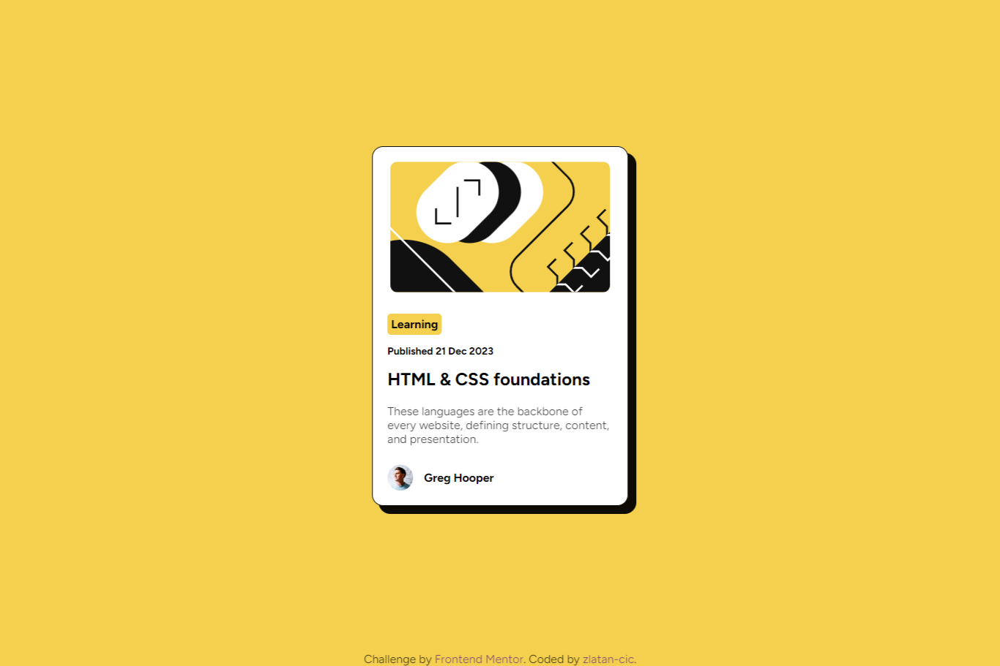

# Frontend Mentor - Blog preview card solution

This is a solution to the [Blog preview card challenge on Frontend Mentor](https://www.frontendmentor.io/challenges/blog-preview-card-ckPaj01IcS). Frontend Mentor challenges help you improve your coding skills by building realistic projects. 

### The challenge

Users should be able to:

- See hover and focus states for all interactive elements on the page

### Screenshot

### Links

- Live Site URL: [Add live site URL here](https://your-live-site-url.com)

### Built with

- Semantic HTML5 markup
- CSS custom properties
- Flexbox
- CSS Grid

### What I learned

In this project, I tackled CSS Grid to manage the layout inside the `.card` component, arranging elements in a structured, grid-based format. CSS Grid is incredibly useful for designs that require a detailed arrangement of components across rows and columns, giving precise control over the layout.

I also utilized CSS Flexbox to efficiently handle alignments and space distribution within elements, particularly in sections like `.type-date` and `.avatar.` Flexbox is perfect for linear layouts—either horizontal or vertical—and it simplifies the process of spacing and aligning elements within a container.

## Author

- Frontend Mentor - [@zlatan-cic](https://www.frontendmentor.io/profile/zlatan-cic)
- GitHub - [zlatan-cic](https://github.com/zlatan-cic)
- Twitter - [@Zlatan_cic](https://twitter.com/Zlatan_cic)

## Acknowledgments

This project was inspired and built upon a challenge provided by Frontend Mentor. [Frontend Mentor](https://www.frontendmentor.io) offers a variety of real-world web development projects that simulate a professional workflow and encourage practical coding experience. I am thankful for the opportunity to tackle such challenges that enhance my front-end development skills and allow me to experiment with new ideas and technologies in a structured environment. A special thanks to Frontend Mentor for providing such an invaluable resource to the developer community.

